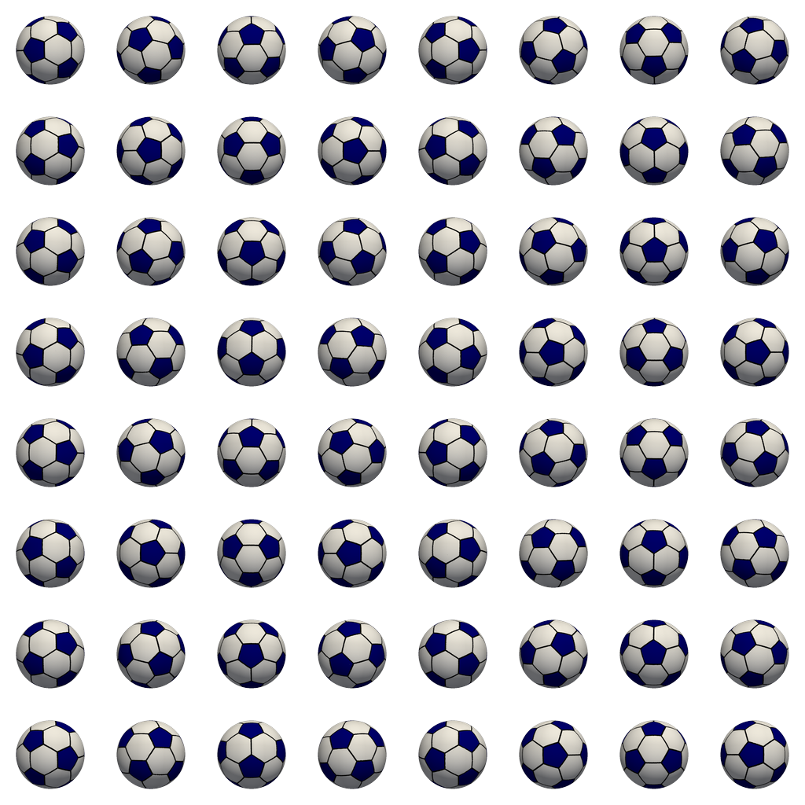
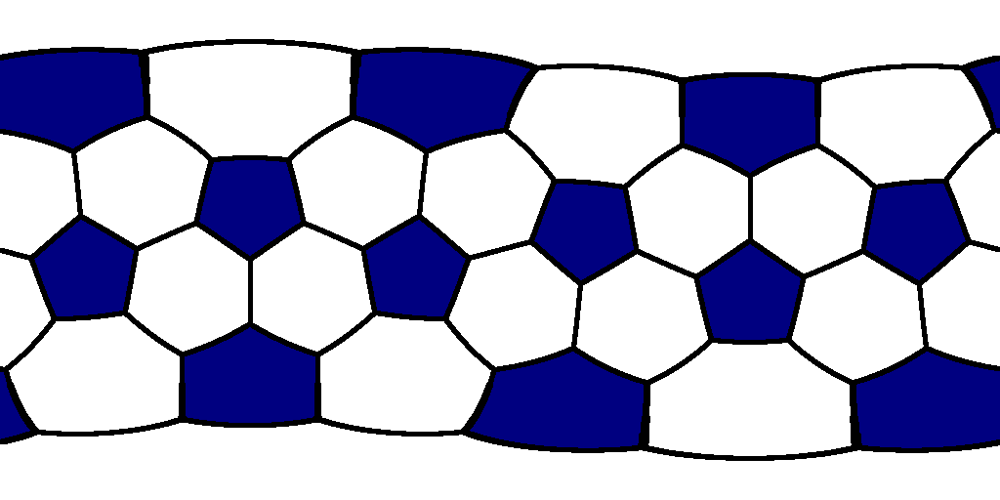

# Soccer Ball Texture Generator

Generate equirectangular textures of truncated icosahedron (soccer ball) patterns with proper great circle interpolation and polar distortion compensation, plus 2D sprite rendering from 3D models.


*Example sprite sheet showing different camera angles and rotations*

## Features

- **Accurate Geometry**: Uses mathematically correct truncated icosahedron vertex coordinates
- **Great Circle Interpolation**: Smooth edge curves using spherical linear interpolation (SLERP)
- **Polar Distortion Compensation**: Adjusts line thickness near poles for equirectangular projection
- **Customizable Colors**: Support for named colors, hex codes, and RGB values
- **Configurable Parameters**: Size, thickness, interpolation quality, and colors
- **3D Visualization**: View generated textures on a 3D sphere
- **2D Sprite Generation**: Render sprites from different camera angles with transparency

## Installation

```bash
pip install pillow pyvista numpy
```

## Usage

### Generate Texture

```bash
# Basic usage (generates soccer_ball_texture.png)
python gen_texture.py

# Custom size and output
python gen_texture.py -s 2048x1024 -o my_soccer_ball.png

# Colored soccer ball
python gen_texture.py --bg-color blue --pentagon-color red -o colored_ball.png

# High quality with thick edges
python gen_texture.py -s 4096 -t 8 -i 2000 -o high_quality.png
```


*An example of generated texture*

### View Texture on 3D Sphere

```bash
# View with default detail level
python view_texture.py soccer_ball_texture.png

# High detail visualization
python view_texture.py my_soccer_ball.png -d 512

# Low detail for performance
python view_texture.py colored_ball.png -d 64
```

### Generate 2D Sprites

```bash
# Generate 4x4 sprite sheet with different camera angles
python make_sprites.py examples/b-and-w.png 4 -s 128x128 -o sprites/ball
```

This creates:
- Individual sprites: `sprites/ball_01_01.png`, `sprites/ball_01_02.png`, etc.
- Composite transparent: `sprites/ball.all.png`
- Composite on green: `sprites/ball.green.png` (for checking transparency)

## Command Line Options

### gen_texture.py

| Option | Description | Default |
|--------|-------------|---------|
| `-o, --output` | Output filename | `soccer_ball_texture.png` |
| `-s, --size` | Size as WIDTH or WIDTHxHEIGHT | `1024x512` |
| `-t, --thickness` | Edge thickness in pixels | `2` |
| `--bg-color` | Background color | `white` |
| `--pentagon-color` | Pentagon color | `black` |
| `--edge-color` | Edge color | Same as pentagon color |
| `-i, --interpolation` | Interpolation points for smooth edges | `1000` |

### view_texture.py

| Option | Description | Default |
|--------|-------------|---------|
| `texture_file` | Texture file to display (required) | - |
| `-d, --detalization` | Sphere detail level | `256` |

### make_sprites.py

| Option | Description | Default |
|--------|-------------|---------|
| `texture_file` | Texture file to apply to sphere (required) | - |
| `count` | Number of sprites to generate (NxN) (required) | - |
| `-s, --size` | Sprite size as WIDTH or WIDTHxHEIGHT | `128x128` |
| `-o, --output-prefix` | Output filename prefix | `sprite` |
| `-d, --detalization` | Sphere detail level | `256` |

## Examples

```bash
# Traditional soccer ball (white background, black pentagons)
python gen_texture.py -o traditional.png

# Inverted colors
python gen_texture.py --bg-color black --pentagon-color white -o inverted.png

# High resolution for printing
python gen_texture.py -s 4096x2048 -t 16 -o print_quality.png

# Fast generation for testing
python gen_texture.py -s 512x256 -t 1 -i 50 -o test.png

# Custom colors with hex codes
python gen_texture.py --bg-color "#FF6B6B" --pentagon-color "#4ECDC4" -o custom.png

# Different edge and pentagon colors
python gen_texture.py --bg-color white --pentagon-color blue --edge-color black -o colored_edges.png
```

## Technical Details

### Truncated Icosahedron Geometry

The soccer ball pattern is based on a truncated icosahedron, which has:
- 60 vertices
- 32 faces (12 pentagons + 20 hexagons)
- 90 edges

### Equirectangular Projection

The texture uses equirectangular projection (longitude/latitude mapping) which:
- Maps longitude to X-axis (0° to 360° → 0 to width)
- Maps latitude to Y-axis (90° to -90° → 0 to height)
- Requires distortion compensation near poles

### Great Circle Interpolation

Edge lines follow great circles (shortest paths on sphere) using:
- Spherical Linear Interpolation (SLERP)
- Haversine formula for distance calculation
- Configurable point density for quality vs. performance

## Color Formats

Supported color formats:
- **Named colors**: `white`, `black`, `red`, `blue`, `green`, etc.
- **Hex codes**: `#FFFFFF`, `#000000`, `#FF0000`
- **RGB strings**: `rgb(255,255,255)`

## Troubleshooting

### Monotone Ball (Pentagon Fill)

If you see a solid color ball instead of black pentagons, the interpolation points are too low:

**Problem**: With very few interpolation points (e.g., `-i 5`), edges become disconnected dots instead of continuous lines. This creates gaps that allow flood fill to leak into adjacent areas, filling the entire texture.

**Solutions**:
- **Increase interpolation points**: Use `-i 100` or higher for proper edge continuity
- **Increase thickness**: It also may work

## License

MIT License - feel free to use in your projects!
